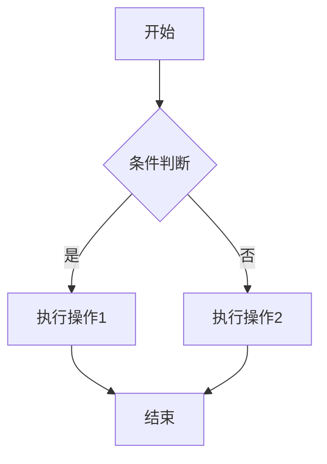
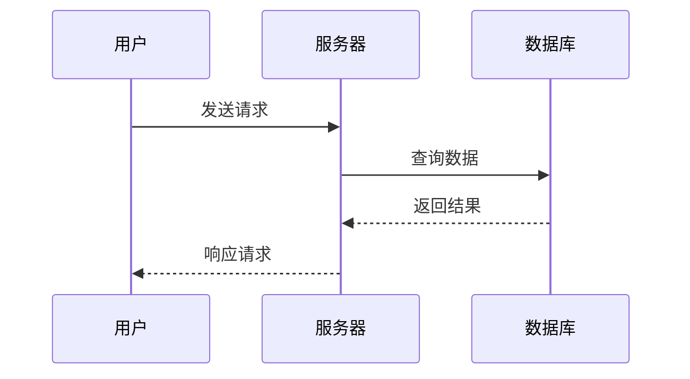
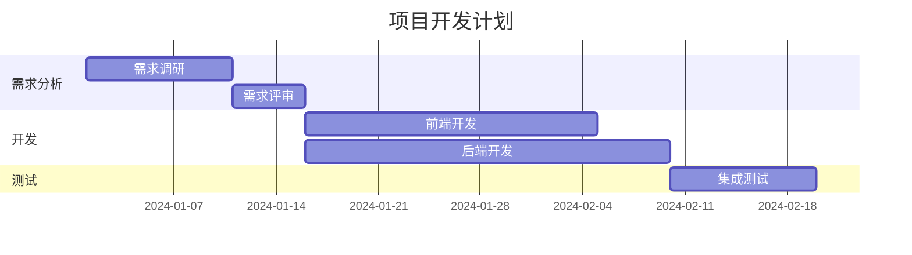
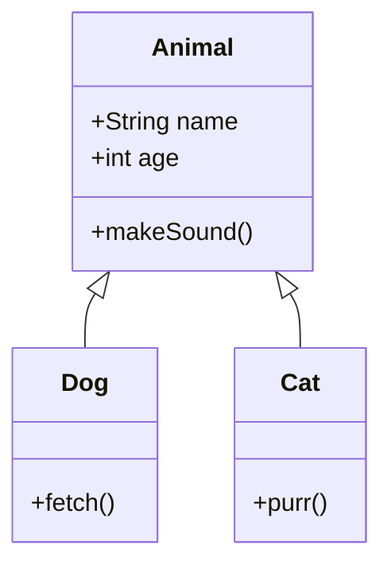

> 适用于 VSC4T 主题的 Mermaid 图表配置指南

## 背景

Mermaid 是一种基于文本的图表描述语言，支持流程图、时序图、甘特图、类图等多种图表类型。通过在 Hexo 中引入 Mermaid，可以在 Markdown 文章中直接用代码生成图表，无需上传图片。

## VSC4T 主题的 Mermaid 支持

VSC4T 主题**已内置 Mermaid 图表支持**（见主题文档的 Features 列表），只需安装一个 Hexo 过滤插件即可启用。

## 配置步骤

### 步骤 1：安装插件

在 Hexo 站点根目录下执行：

```bash
sudo npm install hexo-filter-mermaid-diagrams --save
```

### 步骤 2：确认主题配置

VSC4T 主题已经内置了 Mermaid JS 的加载逻辑，**无需在主题 `_config.yml` 中额外配置**。安装插件后即可直接使用。

如果使用的是其他主题，可能需要在主题模板中手动引入 Mermaid CDN，参考文末的"手动引入方式"。

### 步骤 3：验证

```bash
hexo clean && hexo s
```

打开浏览器访问 `http://localhost:4000`，查看包含 Mermaid 图表的文章，确认图表已正确渲染。

## 在文章中使用

在 Markdown 文章中添加 `mermaid` 代码块：

### 流程图



### 时序图



### 甘特图



### 类图



## 手动引入方式（适用于其他主题）

如果你使用的主题没有内置 Mermaid 支持，可以手动引入：

### 方法 1：在主题模板中添加

找到主题的 `layout/_partial/footer.ejs`（或类似位置），在 `</body>` 前添加：

```html
<script src="https://cdn.jsdelivr.net/npm/mermaid@10/dist/mermaid.min.js"></script>
<script>
  document.addEventListener('DOMContentLoaded', function() {
    mermaid.initialize({ startOnLoad: true });
  });
</script>
```

### 方法 2：使用 Hexo 插件

```bash
npm install hexo-filter-mermaid --save
```

然后在站点 `_config.yml` 中添加：

```yaml
mermaid:
  enable: true
  options:
    theme: 'default'
```

## 常见问题

| 问题 | 解决方案 |
|------|----------|
| 图表不显示，只显示代码 | 检查代码块语言标记是否为 `mermaid`；检查浏览器控制台是否有 JS 错误 |
| 浏览器控制台报 mermaid is not defined | 主题未正确加载 Mermaid JS，尝试手动引入方式 |
| 本地正常但部署后不显示 | 运行 `hexo clean && hexo g && hexo d` 重新生成并部署 |
| Mermaid 语法报错 | 检查语法是否正确，参考 [Mermaid 官方文档](https://mermaid.js.org/) |
| CDN 加载缓慢 | 将 `cdn.jsdelivr.net` 替换为 `unpkg.com` 或其他国内可访问的 CDN |

## 参考链接

- [Mermaid 官方文档](https://mermaid.js.org/)
- [hexo-filter-mermaid-diagrams 插件](https://www.npmjs.com/package/hexo-filter-mermaid-diagrams)
- [VSC4T 主题文档](https://github.com/B143KC47/VSC4T)
