## 一、Java基础

### 1. 集合框架

#### HashMap在JDK1.8的调整（红黑树引入）

**口语化表达：**

HashMap在JDK1.8最大的改动就是引入了红黑树。之前1.7的时候，hash冲突的元素都是用链表存的，链表查找是O(n)，如果冲突特别多，查找就特别慢。1.8就加了个优化：当链表长度超过8并且整个数组容量超过64的时候，链表就会转成红黑树，红黑树查找是O(logn)，快很多。当红黑树的节点减少到6的时候，又会退化回链表，因为节点少的时候链表更省内存。另外1.8还把链表插入方式从头插法改成了尾插法，解决了多线程下扩容时链表成环的问题。

**详细解释说明：**

JDK1.8 对 HashMap 的核心调整：

1. **数据结构升级**：由"数组+链表"变为"数组+链表+红黑树"
2. **链表→红黑树转换条件**：链表长度 ≥ 8 且数组长度 ≥ 64
3. **红黑树→链表退化条件**：红黑树节点数 ≤ 6
4. **插入方式变更**：头插法 → 尾插法

```java
// JDK 1.8 HashMap putVal 方法中的树化逻辑
final void treeifyBin(Node<K,V>[] tab, int hash) {
    int n, index; Node<K,V> e;
    // 数组长度 < 64 时，优先扩容而非树化
    if (tab == null || (n = tab.length) < MIN_TREEIFY_CAPACITY)
        resize();
    else if ((e = tab[index = (n - 1) & hash]) != null) {
        TreeNode<K,V> hd = null, tl = null;
        // 将链表节点转为树节点...
    }
}
```

**阈值选择原因**：
- 链表长度8：泊松分布计算，hash良好的情况下链表长度达到8的概率仅为0.00000006，属于极端情况
- 退化阈值6而非8：设置中间值避免频繁在链表和红黑树之间转换（抖动）

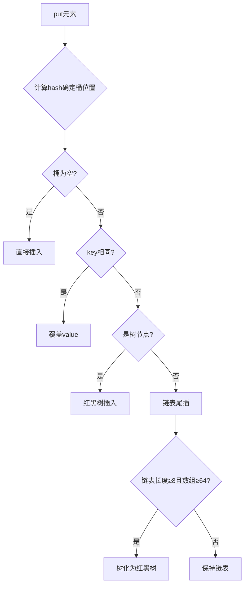

---

#### 红黑树设计原理

**口语化表达：**

红黑树本质上是一棵"近似平衡"的二叉搜索树。它通过五条规则来保证树的平衡：每个节点要么红要么黑、根是黑的、叶子节点是黑的、红节点的孩子必须是黑的、从任一节点到其所有叶子节点的路径上黑节点数量相同。这五条规则限制了最长路径不会超过最短路径的两倍，所以查找效率能保证在O(logn)。相比AVL树的严格平衡，红黑树在插入删除时旋转次数更少，综合性能更好，所以HashMap选了红黑树而不是AVL树。

**详细解释说明：**

红黑树五大性质：

1. 每个节点非红即黑
2. 根节点是黑色
3. 所有叶子节点（NIL）是黑色
4. 红色节点的两个子节点必须都是黑色（不能有连续红节点）
5. 从任一节点到其每个叶子节点的所有路径都包含相同数目的黑色节点

**自平衡机制**：通过变色和旋转（左旋、右旋）来维持平衡

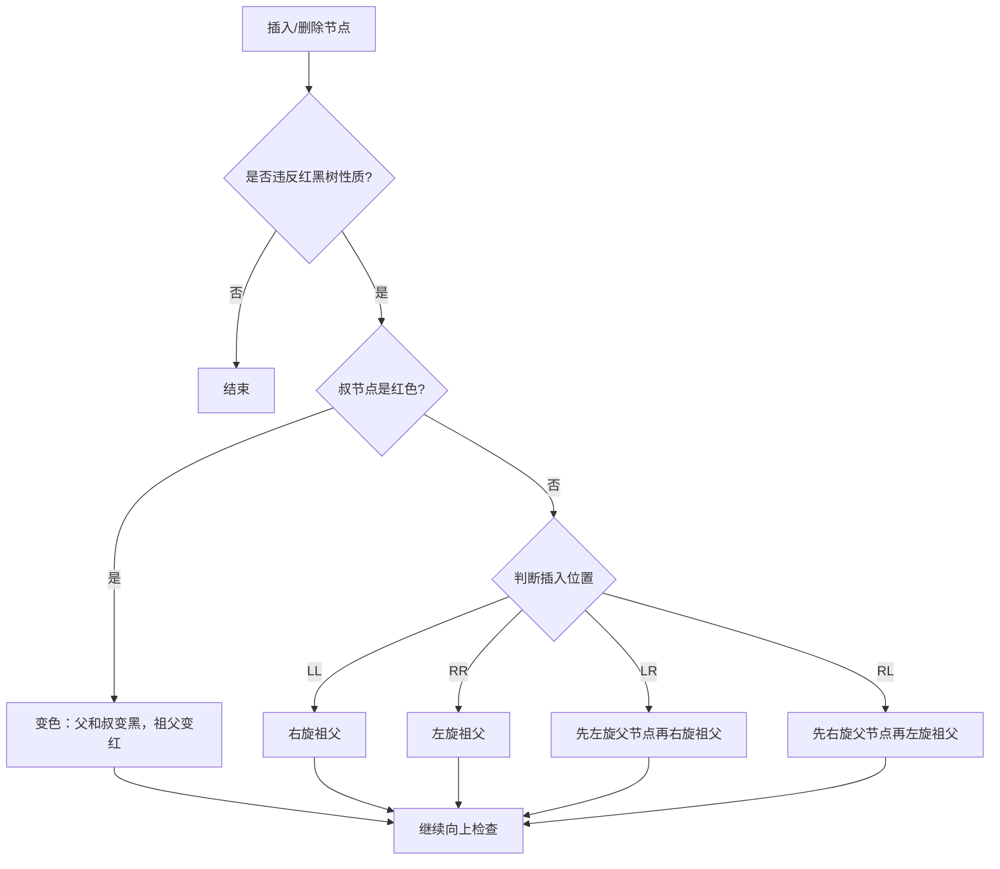

**与AVL树对比**：
| 特性 | 红黑树 | AVL树 |
|------|--------|-------|
| 平衡标准 | 近似平衡（最长路径≤2倍最短路径） | 严格平衡（左右子树高度差≤1） |
| 查找效率 | O(logn)，略慢 | O(logn)，略快 |
| 插入/删除旋转 | 最多3次旋转 | 可能需要O(logn)次旋转 |
| 适用场景 | 频繁增删 | 频繁查找 |

---

#### ConcurrentHashMap 1.7与1.8实现差异

**口语化表达：**

1.7的ConcurrentHashMap用的是分段锁，就是把整个Map分成若干个Segment，每个Segment本身是个小HashMap，每个Segment有自己的锁，不同Segment之间操作不互斥，所以并发度就等于Segment的数量，默认16。1.8就大改了，去掉了Segment，直接用Node数组+链表/红黑树的结构，锁的粒度细化到了每个桶的头节点，用CAS+synchronized来实现，并发度理论上等于数组长度，比1.7高了很多。而且1.8也引入了红黑树优化，和HashMap一样。

**详细解释说明：**

| 对比维度 | JDK 1.7 | JDK 1.8 |
|---------|---------|---------|
| 数据结构 | Segment数组 + HashEntry数组 + 链表 | Node数组 + 链表 + 红黑树 |
| 锁机制 | Segment分段锁（ReentrantLock） | CAS + synchronized（锁桶头节点） |
| 并发度 | Segment数量（默认16） | 数组长度（理论最大） |
| 查询复杂度 | O(n)链表遍历 | O(logn)红黑树 |
| 锁粒度 | Segment级别 | 桶（Node）级别 |

```java
// JDK 1.8 ConcurrentHashMap putVal 核心逻辑
final V putVal(K key, V value, boolean onlyIfAbsent) {
    // 空值校验
    if (key == null || value == null) throw new NullPointerException();
    int hash = spread(key.hashCode());
    for (Node<K,V>[] tab = table;;) {
        Node<K,V> f; int n, i, fh;
        if (tab == null || (n = tab.length) == 0)
            tab = initTable();                // 懒初始化
        else if ((f = tabAt(tab, i = (n - 1) & hash)) == null) {
            if (casTabAt(tab, i, null, new Node<K,V>(hash, key, value, null)))
                break;                        // CAS插入，无锁
        }
        else if ((fh = f.hash) == MOVED)
            tab = helpTransfer(tab, f);       // 协助扩容
        else {
            synchronized (f) {                // 锁住头节点
                // 遍历链表/红黑树，插入或更新
            }
        }
    }
    addCount(1L, binCount);                   // 计数，可能触发扩容
    return null;
}
```

**1.7分段锁结构**：
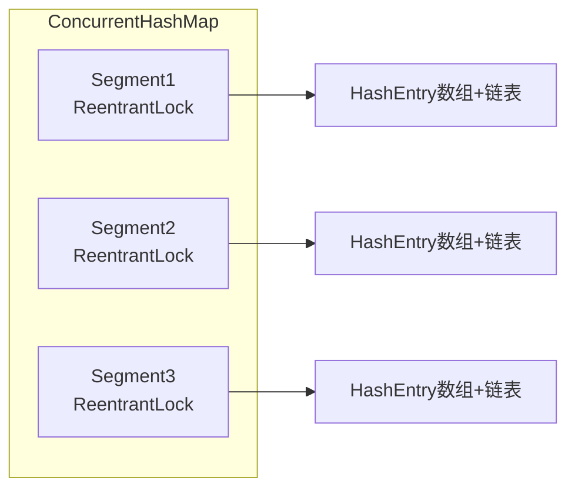

---

#### get()/size()是否需要加锁及实现方式

**口语化表达：**

get操作在1.8里是不需要加锁的，因为Node的val和next都用了volatile修饰，保证了可见性，读的时候能拿到最新值。1.7的get也不加锁，因为HashEntry的val也是volatile的。size方法就比较特殊了，1.7是先不加锁尝试读几次，如果期间数据变化大才锁所有Segment来计算。1.8更巧妙，用了一个baseCount加上CounterCell数组的方式，类似LongAdder的思路，分散计数来减少竞争，最终size就是baseCount加上所有CounterCell的值之和，整个过程也是无锁的。

**详细解释说明：**

**get不加锁原理**：
```java
// Node 类的关键字段
static class Node<K,V> implements Map.Entry<K,V> {
    final int hash;
    final K key;
    volatile V val;       // volatile保证可见性
    volatile Node<K,V> next;  // volatile保证可见性
}
```

**size计数原理（1.8）**：
```java
// 类似 LongAdder 的分散计数思想
private transient volatile long baseCount;
private transient volatile CounterCell[] counterCells;

// size 计算逻辑
final long sumCount() {
    CounterCell[] as = counterCells;
    long sum = baseCount;
    if (as != null) {
        for (CounterCell a : as) {
            if (a != null)
                sum += a.value;
        }
    }
    return sum;
}
```

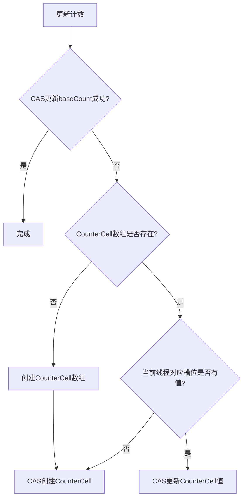

---

### 2. 多线程与并发

#### 线程池创建参数及执行流程

**口语化表达：**

创建线程池最核心的有7个参数：corePoolSize是核心线程数，就算闲着也不回收；maximumPoolSize是最大线程数；keepAliveTime是超出核心数的线程空闲多久被回收；unit是时间单位；workQueue是任务队列，存不下的任务放队列里；threadFactory是创建线程的工厂；handler是拒绝策略，队列和线程都满了怎么办。执行流程就是：来任务先看核心线程有没有空闲，有就交给核心线程；没有就把任务放队列；队列也满了就创建非核心线程；线程数到了最大值还来任务，就执行拒绝策略。

**详细解释说明：**

```java
// ThreadPoolExecutor 7个核心参数
public ThreadPoolExecutor(
    int corePoolSize,                  // 核心线程数
    int maximumPoolSize,               // 最大线程数
    long keepAliveTime,                // 非核心线程空闲存活时间
    TimeUnit unit,                     // 时间单位
    BlockingQueue<Runnable> workQueue, // 任务队列
    ThreadFactory threadFactory,       // 线程工厂
    RejectedExecutionHandler handler   // 拒绝策略
)
```

**四种拒绝策略**：
1. **AbortPolicy**（默认）：抛出RejectedExecutionException
2. **CallerRunsPolicy**：由提交任务的线程自己执行
3. **DiscardPolicy**：直接丢弃，不抛异常
4. **DiscardOldestPolicy**：丢弃队列中最老的任务，重新提交

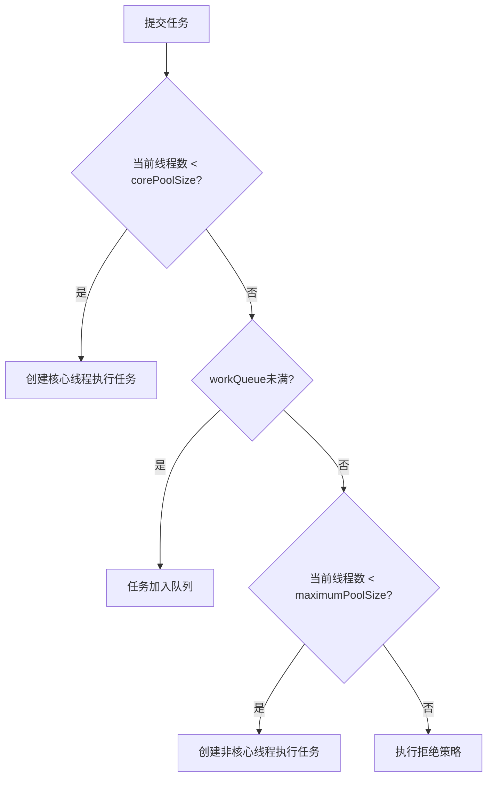

**常见队列选择**：
- **LinkedBlockingQueue**：无界队列（注意OOM风险），Executors.newFixedThreadPool使用
- **SynchronousQueue**：不存储元素，直接交给线程，Executors.newCachedThreadPool使用
- **ArrayBlockingQueue**：有界队列，推荐使用

---

#### CAS与synchronized实现差异

**口语化表达：**

CAS是乐观锁的思想，就是不先加锁，先干活，最后更新的时候看看值有没有被别人改过，没改过就更新成功，改过就重试。它是非阻塞的，适合冲突少的场景。synchronized是悲观锁，上来就加锁，拿到锁才能操作，其他线程等着。它是阻塞的，适合冲突多的场景。CAS的问题是会有ABA问题、自旋开销大、只能保证单个变量的原子操作。synchronized在JDK1.6之后做了很多优化，有偏向锁、轻量级锁、重量级锁的升级过程，性能提升很大。

**详细解释说明：**

| 对比维度 | CAS | synchronized |
|---------|-----|-------------|
| 思想 | 乐观锁（先操作再验证） | 悲观锁（先加锁再操作） |
| 阻塞 | 非阻塞，自旋重试 | 阻塞等待 |
| 适用场景 | 低冲突 | 高冲突 |
| CPU层面 | CPU指令（cmpxchg） | Monitor监视器 |
| 可重入 | 不支持（需配合） | 支持 |
| 作用范围 | 单个变量 | 代码块/方法 |

```java
// CAS 基本原理示例
public class CASExample {
    private AtomicInteger count = new AtomicInteger(0);
    
    public void increment() {
        int oldValue, newValue;
        do {
            oldValue = count.get();      // 读取当前值
            newValue = oldValue + 1;     // 计算新值
        } while (!count.compareAndSet(oldValue, newValue)); // CAS更新
    }
}
```

**synchronized锁升级过程**：
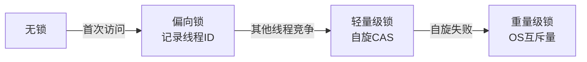

**ABA问题及解决**：
```java
// 使用 AtomicStampedReference 解决ABA问题
AtomicStampedReference<Integer> ref = new AtomicStampedReference<>(1, 1);
// 更新时同时比较值和版本号
ref.compareAndSet(1, 2, 1, 2);  // 期望值1,新值2,期望版本1,新版本2
```

---

#### 进程与线程区别及适用场景

**口语化表达：**

进程是操作系统分配资源的基本单位，线程是CPU调度的基本单位。一个进程里可以有多个线程，它们共享进程的内存空间，所以线程间通信很方便，但也要注意同步问题。进程之间是隔离的，通信得靠管道、共享内存这些IPC机制。进程切换开销大，因为要切换页表这些；线程切换开销小，主要就是保存恢复寄存器。CPU密集型任务适合多进程，避免GIL问题；IO密集型任务适合多线程，线程等IO的时候其他线程可以跑。

**详细解释说明：**

| 对比维度 | 进程 | 线程 |
|---------|------|------|
| 定义 | 资源分配的基本单位 | CPU调度的基本单位 |
| 地址空间 | 独立的地址空间 | 共享进程的地址空间 |
| 通信方式 | 管道、消息队列、共享内存、信号量 | 直接读写共享变量 |
| 切换开销 | 大（需切换页表、TLB等） | 小（共享地址空间） |
| 健壮性 | 一个进程崩溃不影响其他进程 | 一个线程崩溃可能导致整个进程崩溃 |
| 创建开销 | 大 | 小 |

**适用场景**：
- **多进程**：需要高稳定性（如Nginx worker进程）、CPU密集型计算（充分利用多核）、需要资源隔离
- **多线程**：IO密集型任务（如Web服务器）、需要频繁共享数据、追求轻量快速创建

---

#### 泛型在编译期与运行期的作用

**口语化表达：**

Java的泛型是编译期特性，就是类型擦除。编译的时候编译器会用泛型信息做类型检查，保证你不会往List<String>里放Integer，但编译完之后泛型信息就被擦掉了，运行时List<String>和List<Integer>都是同一个类List。所以泛型的作用就是在编译期帮你检查类型安全，减少运行时的ClassCastException。运行期想获取泛型信息基本拿不到，但可以通过反射的一些技巧比如getGenericSuperclass来拿到部分泛型信息。

**详细解释说明：**

**类型擦除规则**：
1. 无界泛型（`<T>`）擦除为Object
2. 有界泛型（`<T extends Comparable>`）擦除为上界Comparable
3. 桥方法保留多态性

```java
// 编译前
public class GenericExample<T> {
    private T value;
    public T getValue() { return value; }
    public void setValue(T value) { this.value = value; }
}

// 编译后（类型擦除）
public class GenericExample {
    private Object value;
    public Object getValue() { return value; }
    public void setValue(Object value) { this.value = value; }
}
```

**桥方法示例**：
```java
// 编译前
class StringPair extends Pair<String> {
    public void setValue(String value) { ... }
}

// 编译后生成桥方法保证多态
class StringPair extends Pair {
    public void setValue(String value) { ... }  // 原方法
    public void setValue(Object value) {         // 桥方法
        setValue((String) value);
    }
}
```

**运行时获取泛型信息的技巧**：
```java
// 通过匿名子类保留泛型信息
abstract class TypeRef<T> {}
TypeRef<List<String>> ref = new TypeRef<List<String>>(){};
// 通过 getGenericSuperclass 可获取 List<String> 类型
Type type = ref.getClass().getGenericSuperclass();
```

---

### 3. JVM相关

#### OOM场景及解决方案

**口语化表达：**

OOM最常见的几种情况：一是堆内存溢出，比如内存泄漏或者创建了太多大对象；二是元空间溢出，动态生成了太多类；三是直接内存溢出，NIO的DirectByteBuffer用太多；四是无法创建新线程，线程数太多了。解决思路就是先看dump文件，用MAT或者VisualVM分析，找出占用内存最大的对象，然后追踪GC Root引用链，看看是谁持有了不该持有的引用。平时也要注意设置合理的JVM参数，加上-XX:+HeapDumpOnOutOfMemoryError方便排查。

**详细解释说明：**

**常见OOM类型**：

| OOM类型 | 触发原因 | 关键参数 |
|---------|---------|---------|
| Java heap space | 堆内存不足 | -Xms, -Xmx |
| Metaspace | 元空间不足 | -XX:MaxMetaspaceSize |
| Direct buffer memory | 直接内存不足 | -XX:MaxDirectMemorySize |
| GC overhead limit exceeded | GC回收效率过低 | -XX:-UseGCOverheadLimit |
| unable to create new native thread | 线程数过多 | 系统限制 |

```java
// 典型内存泄漏示例：静态集合持有对象引用
public class MemoryLeakExample {
    private static final List<Object> CACHE = new ArrayList<>();
    
    public void process() {
        // 不断往静态集合添加对象，但从不清理
        CACHE.add(new byte[1024 * 1024]); // 每次添加1MB
    }
}

// 解决方案：使用WeakHashMap或及时清理
private static final Map<Object, Object> CACHE = new WeakHashMap<>();
```

**排查流程**：
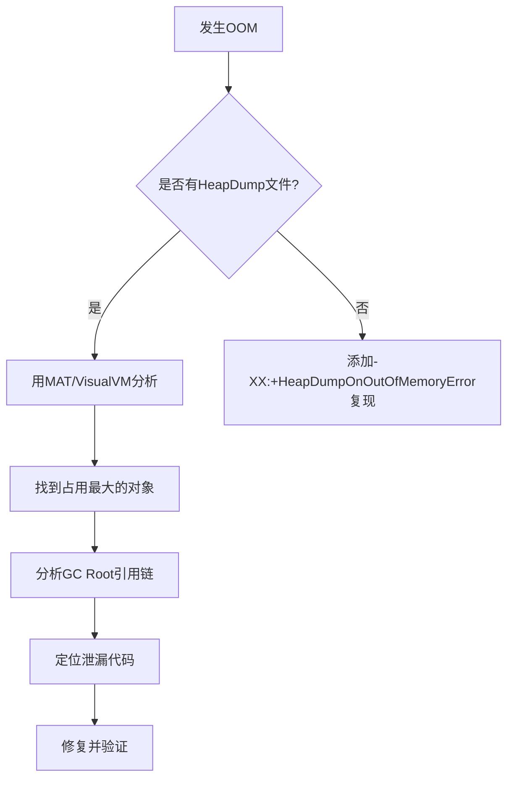

---

#### FGC触发条件及频繁FGC原因

**口语化表达：**

Full GC触发条件主要有几个：调用System.gc()（只是建议不一定会触发）、老年代空间不足、元空间不足、CMS的concurrent mode failure（并发标记阶段老年代放不下新对象了）。频繁Full GC的原因主要有：内存泄漏导致老年代一直涨；大对象直接进老年代；内存分配速率过高；CMS的碎片太多导致提前触发；元空间类加载过多。解决的话先看GC日志，分析是哪种原因，然后对症下药，比如调大内存、优化代码减少对象创建、换G1收集器等。

**详细解释说明：**

**FGC触发条件**：

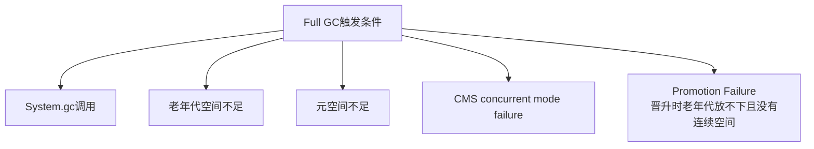

**频繁FGC排查步骤**：
1. 查看GC日志：`-Xlog:gc*`（JDK9+）或 `-XX:+PrintGCDetails`
2. 使用jstat观察各区域变化：`jstat -gcutil <pid> 1000`
3. 使用jmap查看对象统计：`jmap -histo <pid>`
4. Dump分析：`jmap -dump:format=b,file=heap.hprof <pid>`

**常见原因及对策**：

| 原因 | 对策 |
|------|------|
| 内存泄漏 | MAT分析dump，找到泄漏点 |
| 大对象频繁分配 | 优化代码，避免大数组 |
| 内存碎片过多 | 使用G1或开启压缩整理 |
| 元空间不足 | 增大MaxMetaspaceSize或排查动态类生成 |
| 显式System.gc() | 添加-XX:+DisableExplicitGC |

---

#### JVM内存划分模型

**口语化表达：**

JVM内存主要分五大块：堆是存对象的，GC主要管这块；方法区（1.8后叫元空间）存类信息、常量这些；虚拟机栈是每个线程独有的，存局部变量和方法调用；本地方法栈是给native方法用的；程序计数器记录当前执行的字节码行号。其中堆和方法区是线程共享的，栈和计数器是线程私有的。堆一般又分新生代和老年代，新生代分Eden和两个Survivor区，比例默认8:1:1。

**详细解释说明：**

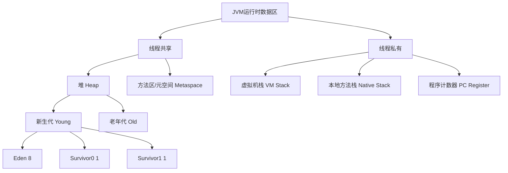

| 区域 | 存储内容 | 异常类型 | 线程归属 |
|------|---------|---------|---------|
| 堆 | 对象实例、数组 | OutOfMemoryError | 共享 |
| 方法区/元空间 | 类信息、常量、静态变量 | OutOfMemoryError | 共享 |
| 虚拟机栈 | 栈帧（局部变量、操作数栈等） | StackOverflowError / OOM | 私有 |
| 本地方法栈 | native方法调用 | StackOverflowError / OOM | 私有 |
| 程序计数器 | 当前执行的字节码指令地址 | 无 | 私有 |

**JDK1.8前后方法区变化**：
- 1.7：永久代（PermGen），JVM自身管理的内存区域，大小有限
- 1.8：元空间（Metaspace），使用本地内存，受物理内存限制

---

#### 垃圾回收算法与调优实践

**口语化表达：**

垃圾回收有三大基础算法：标记清除，就是先标记要回收的对象，然后直接清除，缺点是有碎片；标记整理，标记完后把存活对象往一端挪，然后清理边界外的，没有碎片但移动开销大；复制算法，把内存分两块，存活对象复制到另一块，然后当前块直接清掉，没有碎片但浪费一半空间。实际JVM用的是分代收集，新生代用复制算法（Eden+Survivor），老年代用标记清除或标记整理。调优的话，主要是调堆大小、新生代老年代比例、选择合适的收集器，根据业务特点来。

**详细解释说明：**

**三种基础算法对比**：

| 算法 | 优点 | 缺点 | 适用区域 |
|------|------|------|---------|
| 标记-清除 | 简单，不需要移动对象 | 内存碎片 | 老年代（CMS） |
| 标记-整理 | 无碎片 | 移动对象开销大 | 老年代（Parallel Old） |
| 复制 | 无碎片，效率高 | 浪费50%空间 | 新生代 |

**分代收集策略**：
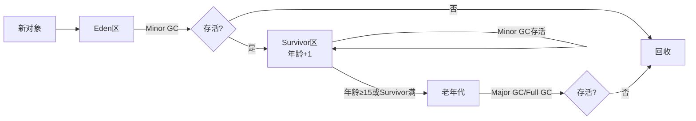

**常见收集器选择**：
- **单线程/小内存**：Serial + Serial Old
- **吞吐量优先**：Parallel Scavenge + Parallel Old
- **延迟优先**：ParNew + CMS
- **大堆/均衡**：G1（JDK9默认）
- **超大堆**：ZGC（JDK15+）

**调优关键参数**：
```bash
# 堆大小
-Xms4g -Xmx4g                    # 初始和最大堆大小相同，避免动态扩容
# 新生代比例
-XX:NewRatio=2                    # 老年代:新生代 = 2:1
-XX:SurvivorRatio=8               # Eden:S0:S1 = 8:1:1
# GC选择
-XX:+UseG1GC                      # 使用G1收集器
-XX:MaxGCPauseMillis=200          # 目标最大停顿时间
# GC日志
-Xlog:gc*:file=gc.log             # JDK9+日志配置
```

---

## 二、数据库技术

### 1. MySQL

#### 索引失效的典型场景

**口语化表达：**

索引失效最常见的就是对索引列用了函数或运算，比如where year(create_time) = 2024就失效了，要改成create_time >= '2024-01-01'。还有隐式类型转换，比如varchar字段用数字查，MySQL会做隐式转换导致索引失效。联合索引不满足最左前缀原则也会失效。用了OR连接且有一个条件没索引。LIKE以通配符开头也会失效。NOT IN、NOT EXISTS也可能导致失效。还有就是MySQL优化器觉得全表扫描更快的时候也会选择不走索引。

**详细解释说明：**

**典型索引失效场景**：

1. **对索引列使用函数/运算**
```sql
-- ❌ 失效
SELECT * FROM user WHERE YEAR(create_time) = 2024;
-- ✅ 优化
SELECT * FROM user WHERE create_time >= '2024-01-01' AND create_time < '2025-01-01';

-- ❌ 失效
SELECT * FROM user WHERE id + 1 = 10;
-- ✅ 优化
SELECT * FROM user WHERE id = 9;
```

2. **隐式类型转换**
```sql
-- ❌ phone是varchar，传入数字，MySQL会对phone列做隐式转换
SELECT * FROM user WHERE phone = 13800138000;
-- ✅ 传入字符串
SELECT * FROM user WHERE phone = '13800138000';
```

3. **联合索引不满足最左前缀**
```sql
-- 索引 idx_abc(a, b, c)
-- ❌ 失效：缺少最左列a
SELECT * FROM t WHERE b = 1 AND c = 2;
-- ✅ 走索引
SELECT * FROM t WHERE a = 1 AND c = 2;  -- 走a的索引
```

4. **LIKE通配符开头**
```sql
-- ❌ 失效
SELECT * FROM user WHERE name LIKE '%张';
-- ✅ 走索引
SELECT * FROM user WHERE name LIKE '张%';
```

5. **OR连接无索引列**
```sql
-- ❌ 如果b没有索引，整个条件都不走索引
SELECT * FROM t WHERE a = 1 OR b = 2;
```

6. **NOT IN / NOT EXISTS / != / <>**
```sql
-- ❌ 可能失效（取决于数据分布）
SELECT * FROM user WHERE status != 1;
```

---

#### 事务特性（ACID）与隔离级别

**口语化表达：**

ACID就是原子性、一致性、隔离性、持久性。原子性是事务要么全成功要么全失败，靠undo log实现；一致性是数据从一个合法状态到另一个合法状态，是最终目标；隔离性是并发事务互不干扰，靠锁和MVCC实现；持久性是提交了就不会丢，靠redo log实现。隔离级别有四个：读未提交会脏读，读已提交解决了脏读但有不可重复读，可重复读解决了不可重复读但有幻读（MySQL的RR通过MVCC+间隙锁基本解决了幻读），串行化完全隔离但性能最差。

**详细解释说明：**

| 隔离级别 | 脏读 | 不可重复读 | 幻读 | 性能 |
|---------|------|-----------|------|------|
| READ UNCOMMITTED | ✓ | ✓ | ✓ | 最高 |
| READ COMMITTED | ✗ | ✓ | ✓ | 高 |
| REPEATABLE READ | ✗ | ✗ | 基本避免✓ | 中 |
| SERIALIZABLE | ✗ | ✗ | ✗ | 最低 |

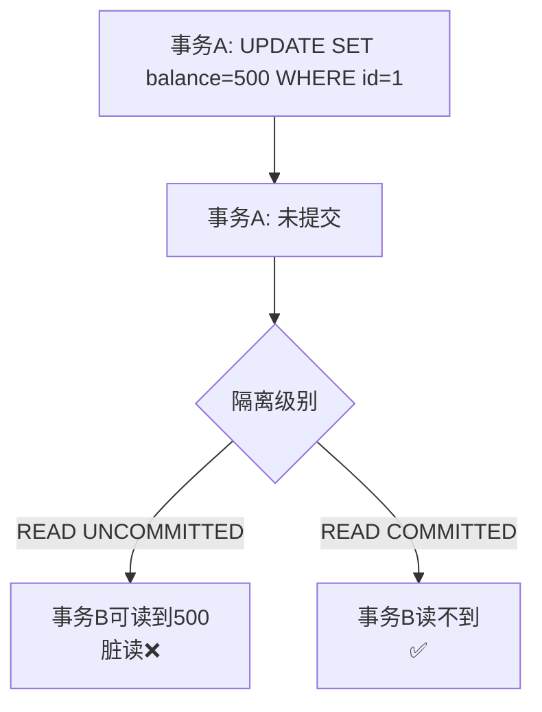

**MySQL RR级别解决幻读**：
- **快照读**（普通SELECT）：MVCC，读取事务开始时的快照
- **当前读**（SELECT FOR UPDATE/INSERT/UPDATE/DELETE）：间隙锁+临键锁，锁住记录及间隙

---

#### 性别字段是否适合建索引

**口语化表达：**

性别字段不适合建索引，因为区分度太低了。一般性别就两个值，就算建了索引，MySQL优化器发现通过索引查出来的数据占表的大半，还不如直接全表扫描快，就会选择不走索引。索引是要建在区分度高的字段上的，比如身份证号、手机号这种几乎每条记录都不一样的。性别字段如果确实有查询需求，可以考虑和其他区分度高的字段建联合索引，放在后面。

**详细解释说明：**

**索引选择性公式**：
```
选择性 = COUNT(DISTINCT col) / COUNT(*)
```
选择性越接近1，索引效果越好。性别字段的选择性约为0.5/总记录数，极低。

**优化器选择**：当通过索引查出的数据超过表的约30%时，优化器倾向全表扫描（顺序IO比随机IO快）。

**如果确实需要筛选性别**：
```sql
-- 联合索引，性别放后面
CREATE INDEX idx_gender_city ON user(city, gender);
-- 查询可以利用联合索引
SELECT * FROM user WHERE city = '北京' AND gender = 'F';
```

---

#### 数据库调优方法论

**口语化表达：**

数据库调优我一般按这个顺序来：先看SQL本身有没有问题，用EXPLAIN看执行计划，有没有全表扫描、索引有没有用上；然后看索引设计合不合理，有没有冗余索引、缺失索引；再看表结构设计，字段类型对不对、有没有大字段；然后看MySQL参数配置，缓冲池够不够、连接数合不合理；最后看硬件层面，磁盘IO是不是瓶颈。整个过程要结合慢查询日志来定位问题SQL，然后逐个优化。

**详细解释说明：**

**调优层次**：
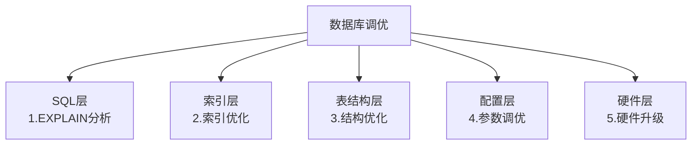

**EXPLAIN关键字段**：
| 字段 | 关注点 |
|------|--------|
| type | 访问类型，至少达到range级别 |
| key | 实际使用的索引 |
| rows | 预估扫描行数 |
| Extra | Using filesort/Using temporary 需要优化 |

**常见配置参数**：
```ini
innodb_buffer_pool_size = 物理内存的60-80%
innodb_io_capacity = SSD设10000+/HDD设200
innodb_flush_method = O_DIRECT
slow_query_log = ON
long_query_time = 1
```

---

### 2. Redis

#### 五种核心数据结构

**口语化表达：**

Redis有五种基本数据类型：String是最基础的，可以存字符串、数字，还能做计数器；List是链表，可以做消息队列、栈；Set是无序集合，自动去重，可以做标签、共同好友；ZSet是有序集合，多了个score排序，可以做排行榜；Hash是哈希表，适合存对象。底层实现上，String用的是SDS，List用的是quicklist（ziplist+linkedlist），Set小的时候用intset大的用hashtable，ZSet用ziplist或skiplist+hashtable，Hash用ziplist或hashtable。

**详细解释说明：**

| 类型 | 底层编码 | 常见应用 |
|------|---------|---------|
| String | int / embstr / raw | 缓存、计数器、分布式锁 |
| List | quicklist（ziplist+linkedlist） | 消息队列、最新消息排行 |
| Set | intset / hashtable | 标签、共同好友、抽奖 |
| ZSet | ziplist / skiplist+hashtable | 排行榜、延迟队列 |
| Hash | ziplist / hashtable | 对象存储、购物车 |

```bash
# String - 计数器
SET article:1:views 0
INCR article:1:views

# List - 消息队列
LPUSH queue:email "task1"
RPOP queue:email

# Set - 共同好友
SADD user:1:friends "A" "B" "C"
SADD user:2:friends "B" "C" "D"
SINTER user:1:friends user:2:friends  # 返回 B C

# ZSet - 排行榜
ZADD rank:score 100 "player1" 95 "player2" 98 "player3"
ZREVRANGE rank:score 0 9 WITHSCORES  # Top10

# Hash - 对象
HSET user:1 name "张三" age 25 city "北京"
HGET user:1 name
```

---

#### 高速缓存实现原理

**口语化表达：**

Redis快的原因主要有几个：一是纯内存操作，数据都在内存里，内存的读写速度远超磁盘；二是单线程模型，避免了上下文切换和锁竞争的开销，虽然6.0引入了多线程IO，但命令执行还是单线程；三是IO多路复用，用epoll一个线程处理大量连接；三是高效的数据结构，SDS、跳表、ziplist这些专门优化的结构。另外还有Reactor模式，把网络事件分发给对应的处理器来处理。

**详细解释说明：**

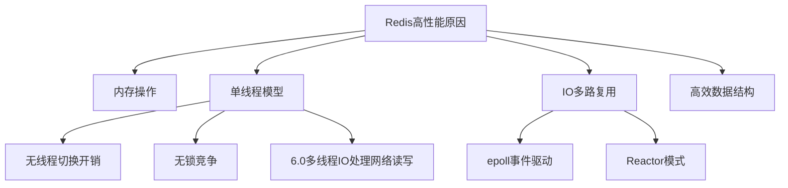

**Redis 6.0 多线程模型**：
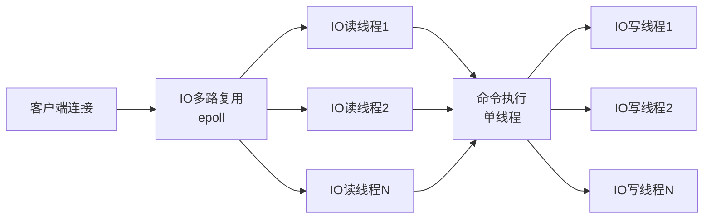

---

#### 集群部署模式（主从/哨兵/Cluster）

**口语化表达：**

Redis集群有三种模式。主从复制就是一主多从，主写从读，做数据备份和读写分离，但主挂了得手动切。哨兵模式在主从基础上加了哨兵进程，自动监控主节点健康状态，主挂了自动做故障转移，选新主。Cluster模式是真正的分布式，数据分片存在多个主节点上，每个主节点负责一部分slot（共16384个），支持横向扩展，每个主节点还可以有从节点做备份。小规模用哨兵，大规模用Cluster。

**详细解释说明：**

| 模式 | 特点 | 适用场景 |
|------|------|---------|
| 主从复制 | 一主多从，手动故障转移 | 数据备份、读写分离 |
| 哨兵 | 自动故障转移，监控 | 中小规模高可用 |
| Cluster | 数据分片，自动故障转移 | 大规模、高并发 |

**Cluster槽位分配**：
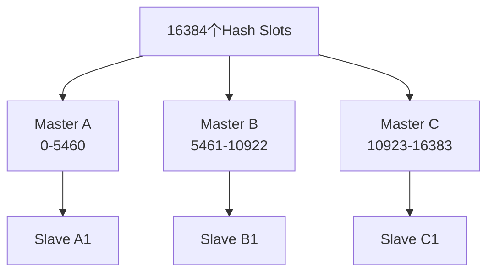

**键路由计算**：
```bash
# slot = CRC16(key) % 16384
# 例如 key="user:1"
# slot = CRC16("user:1") % 16384
```

---

#### 与数据库数据一致性方案

**口语化表达：**

缓存和数据库一致性是经典问题，没有完美方案只有权衡。最常用的是Cache Aside模式：读的时候先读缓存，没有就查数据库再写缓存；写的时候先更新数据库再删缓存。为什么是删缓存而不是更新缓存？因为并发下更新缓存可能出现数据错乱，删的话下次读自然会重新加载。为什么先更新数据库再删缓存？因为先删缓存的话，另一个请求可能把旧数据又写回缓存。即便如此，先更新数据库再删缓存也有极小概率不一致，可以用延迟双删或者订阅binlog来保证最终一致性。

**详细解释说明：**

**Cache Aside 模式**：
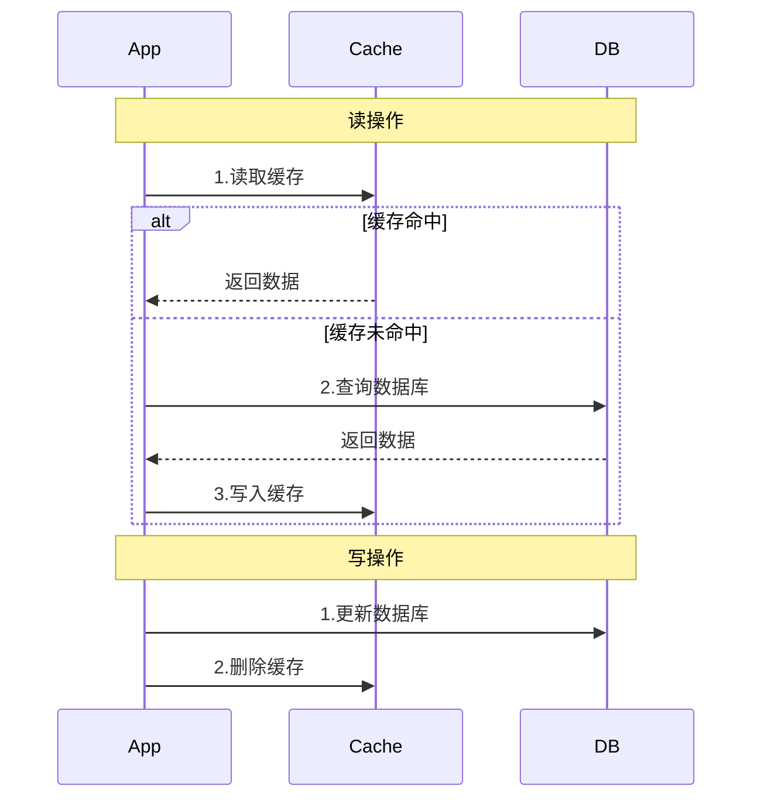

**延迟双删策略**：
```java
public void write(String key, Object value) {
    // 1. 先删缓存
    cache.delete(key);
    // 2. 更新数据库
    db.update(key, value);
    // 3. 延迟再删一次（防止并发读回写旧数据）
    scheduledExecutor.schedule(() -> cache.delete(key), 500, TimeUnit.MILLISECONDS);
}
```

**基于Binlog的最终一致性**：
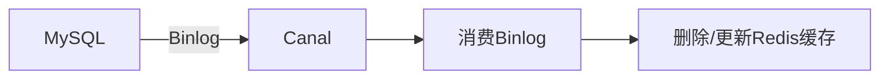

---

## 三、框架与中间件

### 1. Spring生态

#### 常用设计模式（工厂/代理/模板）

**口语化表达：**

Spring里设计模式用得特别多。工厂模式最典型的是BeanFactory和ApplicationContext，把对象的创建交给Spring管理，不需要自己new。代理模式就是AOP的底层实现，JDK动态代理针对接口，CGLIB针对类，Spring默认接口用JDK代理、类用CGLIB。模板模式就是JdbcTemplate、RestTemplate这些，把通用的流程固定下来，把变化的部分留给子类或回调实现。还有单例模式的Bean默认scope、观察者模式的事件机制、适配器模式的HandlerAdapter等。

**详细解释说明：**

**1. 工厂模式 - BeanFactory / ApplicationContext**
```java
// BeanFactory 延迟加载，ApplicationContext 预加载
BeanFactory factory = new XmlBeanFactory(new ClassPathResource("beans.xml"));
UserService service = factory.getBean(UserService.class); // 工厂创建对象
```

**2. 代理模式 - AOP**
```java
// JDK动态代理（基于接口）
public class JdkProxy implements InvocationHandler {
    private Object target;
    public Object invoke(Object proxy, Method method, Object[] args) {
        // 前置增强
        Object result = method.invoke(target, args);
        // 后置增强
        return result;
    }
}

// CGLIB代理（基于类继承，生成子类）
// SpringBoot 2.x 默认使用 CGLIB
```

**3. 模板模式 - JdbcTemplate**
```java
// 固定流程：获取连接 → 执行SQL → 处理结果 → 关闭连接
// 变化部分：SQL语句和结果映射
jdbcTemplate.query("SELECT * FROM user WHERE id = ?",
    (rs, rowNum) -> {  // 变化部分：ResultSet映射
        User user = new User();
        user.setId(rs.getLong("id"));
        user.setName(rs.getString("name"));
        return user;
    }, 1L);
```

---

#### Bean生命周期全流程

**口语化表达：**

Spring Bean的生命周期可以简单概括为：实例化→属性填充→初始化→使用→销毁。详细说的话，先是BeanDefinition的注册，然后实例化（反射创建对象），然后属性注入（@Autowired等），然后各种Aware接口回调，然后BeanPostProcessor的前置处理，然后InitializingBean的afterPropertiesSet和自定义init方法，然后BeanPostProcessor的后置处理（AOP代理就是在这步创建的），这时候Bean就可以用了。销毁的时候调DisposableBean的destroy和自定义destroy方法。

**详细解释说明：**

```mermaid
flowchart TD
    A[BeanDefinition注册] --> B[实例化<br/>反射创建对象]
    B --> C[属性填充<br/>@Autowired/@Value]
    C --> D[Aware接口回调<br/>BeanNameAware/BeanFactoryAware/ApplicationContextAware]
    D --> E[BeanPostProcessor.postProcessBeforeInitialization]
    E --> F[InitializingBean.afterPropertiesSet]
    F --> G[自定义init-method]
    G --> H[BeanPostProcessor.postProcessAfterInitialization<br/>AOP代理在此创建]
    H --> I[Bean就绪，可使用]
    I --> J[DisposableBean.destroy]
    J --> K[自定义destroy-method]
```

---

#### AOP与IOC核心应用

**口语化表达：**

IOC就是控制反转，把对象的创建和依赖关系管理从代码里拿出来交给Spring容器，以前是自己new对象，现在是Spring注入。好处是解耦，对象之间不再硬编码依赖。AOP是面向切面编程，把和业务无关但很多地方都要用的功能（日志、事务、权限等）抽取出来，通过动态代理织入到目标方法前后。底层就是代理模式，JDK代理或CGLIB代理。IOC是Spring的基础，AOP是IOC的增强。

**详细解释说明：**

**IOC/DI示例**：
```java
// 不用IOC：硬编码依赖
public class UserService {
    private UserDao userDao = new UserDaoImpl(); // 紧耦合
}

// 使用IOC：依赖注入
@Service
public class UserService {
    @Autowired  // 松耦合，由Spring容器注入
    private UserDao userDao;
}
```

**AOP核心概念**：
| 概念 | 说明 |
|------|------|
| 切面 Aspect | 横切关注点的模块化（如日志切面） |
| 连接点 JoinPoint | 程序执行中的点（方法调用） |
| 切入点 Pointcut | 匹配连接点的表达式 |
| 通知 Advice | 在切入点执行的动作（Before/After/Around等） |

```java
@Aspect
@Component
public class LogAspect {
    
    @Around("execution(* com.example.service.*.*(..))")
    public Object logAround(ProceedingJoinPoint pjp) throws Throwable {
        long start = System.currentTimeMillis();
        Object result = pjp.proceed();  // 执行目标方法
        long cost = System.currentTimeMillis() - start;
        log.info("{} 执行耗时: {}ms", pjp.getSignature(), cost);
        return result;
    }
}
```

---

#### 分布式事务实现方案（TCC/SAGA）

**口语化表达：**

分布式事务就是跨多个服务或数据库的事务，不能简单用本地事务保证。TCC是Try-Confirm-Cancel，Try阶段预留资源，Confirm阶段确认提交，Cancel阶段回滚释放资源，优点是锁粒度细，缺点是业务侵入大，每个操作都要写三个方法。SAGA是一系列本地事务组成的链，每个本地事务有对应的补偿操作，正向执行失败就反向补偿，适合长事务，但缺乏隔离性，可能出现脏读。还有基于消息的最终一致性，把事务和消息绑定，保证消息一定发出且被消费。

**详细解释说明：**

**TCC模式**：
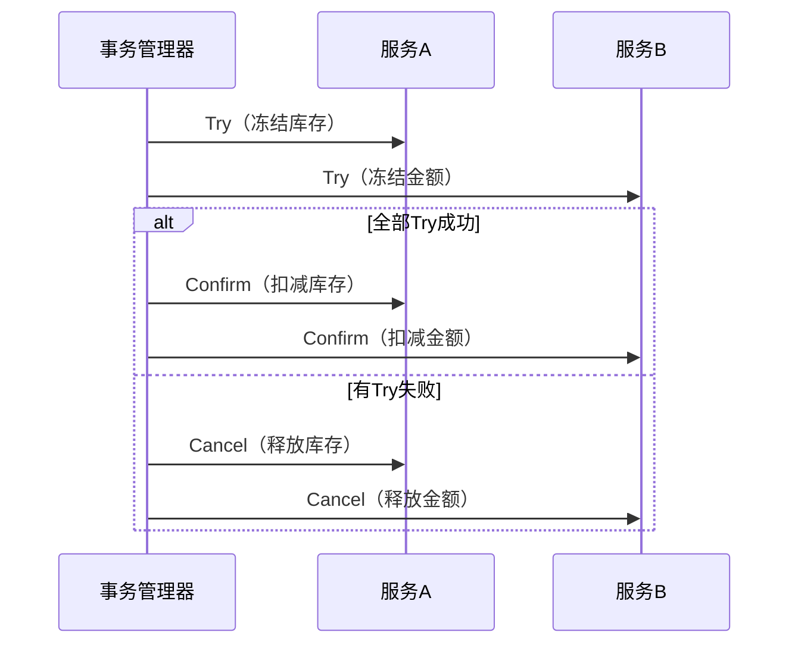

**SAGA模式**：
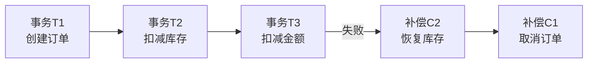

| 方案 | 一致性 | 隔离性 | 侵入性 | 适用场景 |
|------|--------|--------|--------|---------|
| TCC | 强一致 | 较好 | 大 | 资金相关 |
| SAGA | 最终一致 | 差 | 中 | 长流程业务 |
| 消息最终一致 | 最终一致 | 无 | 小 | 异步场景 |

---

### 2. Spring Cloud

#### 核心组件（Eureka/Gateway/Feign）

**口语化表达：**

Spring Cloud核心组件：Eureka是服务注册发现中心，服务启动时注册上去，消费端从Eureka获取服务列表做负载均衡，但它已经停更了，现在多用Nacos。Gateway是网关，所有请求先到网关，做路由转发、限流、鉴权这些，替代了Zuul。Feign是声明式HTTP客户端，像调本地方法一样调远程服务，内置了Ribbon做负载均衡，还有熔断降级能力。现在Spring Cloud Alibaba这一套更流行，Nacos替代Eureka和Config，Sentinel做熔断限流。

**详细解释说明：**

```mermaid
flowchart TD
    Client[客户端] --> Gateway[API Gateway<br/>路由/限流/鉴权]
    Gateway --> ServiceA[服务A]
    Gateway --> ServiceB[服务B]
    ServiceA -->|Feign调用| ServiceB
    
    ServiceA --> Eureka[Eureka/Nacos<br/>服务注册中心]
    ServiceB --> Eureka
```

**各组件职责**：
| 组件 | 职责 | 替代方案 |
|------|------|---------|
| Eureka | 服务注册与发现 | Nacos、Consul |
| Gateway | API网关 | Nginx、Kong |
| Feign | 声明式HTTP调用 | RestTemplate、WebClient |
| Ribbon | 客户端负载均衡 | Spring Cloud LoadBalancer |
| Hystrix | 熔断降级 | Sentinel、Resilience4j |
| Config | 配置中心 | Nacos、Apollo |

---

#### 事务失效的常见原因

**口语化表达：**

Spring事务失效的场景很多，最常见的就是方法不是public的，Spring AOP默认只对public方法生效。还有就是自调用，同一个类里方法A调方法B，B上的@Transactional不生效，因为没经过代理对象。异常类型不对，默认只对RuntimeException和Error回滚，checked异常不回滚。异常被catch了没抛出去，事务管理器不知道出错了也不会回滚。数据库引擎不支持事务，比如MyISAM。还有传播行为设置不当，比如REQUIRES_NEW开了新事务。

**详细解释说明：**

**常见失效场景及解决**：

1. **方法非public**
```java
// ❌ 事务不生效
@Transactional
private void process() { ... }

// ✅ 改为public
@Transactional
public void process() { ... }
```

2. **自调用（未经过代理对象）**
```java
// ❌ 同类调用，B的事务不生效
@Service
public class UserService {
    public void methodA() {
        this.methodB(); // 直接调用，未走代理
    }
    @Transactional
    public void methodB() { ... }
}

// ✅ 解决方案1：注入自身
@Autowired
private UserService self;
public void methodA() {
    self.methodB(); // 通过代理对象调用
}

// ✅ 解决方案2：AopContext.currentProxy()
public void methodA() {
    ((UserService) AopContext.currentProxy()).methodB();
}
```

3. **异常类型不匹配**
```java
// ❌ 默认只回滚RuntimeException
@Transactional
public void process() throws Exception {
    throw new IOException("checked异常"); // 不回滚
}

// ✅ 指定回滚异常类型
@Transactional(rollbackFor = Exception.class)
public void process() throws Exception {
    throw new IOException("checked异常"); // 回滚
}
```

4. **异常被吞**
```java
// ❌ 异常被catch
@Transactional
public void process() {
    try {
        // 业务操作
    } catch (Exception e) {
        log.error("error", e); // 异常没抛出，不回滚
    }
}
```

---

### 3. 消息队列

#### MQ事务消息发布流程

**口语化表达：**

事务消息就是保证本地事务和消息发送要么都成功要么都失败。以RocketMQ为例，先发半消息到Broker，这个消息消费者暂时看不到；然后执行本地事务，如果成功了就发commit，消费者就能看到了；如果失败了就发rollback，Broker就把半消息删了。问题是如果本地事务执行完了但commit/rollback没发出去怎么办？Broker会定期回查本地事务状态，生产者要实现回查接口返回事务状态，然后Broker根据回查结果决定提交还是回滚。

**详细解释说明：**

```mermaid
sequenceDiagram
    participant Producer
    participant Broker
    participant Consumer
    
    Producer->>Broker: 1.发送半消息(Half Message)
    Broker-->>Producer: 半消息发送成功
    Producer->>Producer: 2.执行本地事务
    alt 本地事务成功
        Producer->>Broker: 3a.发送Commit
        Broker->>Consumer: 4.投递消息
    else 本地事务失败
        Producer->>Broker: 3b.发送Rollback
        Broker->>Broker: 删除半消息
    end
    
    Note over Producer,Broker: 如果3a/3b未送达
    Broker->>Producer: 事务回查(Check)
    Producer-->>Broker: 返回事务状态
```

---

#### Kafka消费顺序保证机制

**口语化表达：**

Kafka保证顺序的粒度是Partition，同一个Partition内的消息是有序的，不同Partition之间不保证顺序。所以如果要保证一组消息的顺序，就得让它们进同一个Partition，一般就是指定相同的key，Kafka会根据key做hash路由到固定的Partition。但这样又牺牲了并发度，因为一个Partition只能被一个Consumer消费。如果要全局有序就只能用一个Partition一个Consumer，但吞吐量就低了，所以一般是业务分组有序就够了。

**详细解释说明：**

```mermaid
flowchart LR
    subgraph 生产者
        P1[Key=order1] 
        P2[Key=order2]
        P3[Key=order1]
    end
    
    subgraph Topic-3个Partition
        PA[Partition 0<br/>order1的消息有序]
        PB[Partition 1<br/>order2的消息有序]
        PC[Partition 2]
    end
    
    P1 -->|hash(order1)%3| PA
    P3 -->|hash(order1)%3| PA
    P2 -->|hash(order2)%3| PB
    
    subgraph 消费者组
        C1[Consumer 0<br/>按序消费P0]
        C2[Consumer 1<br/>按序消费P1]
    end
    
    PA --> C1
    PB --> C2
```

**关键配置**：
```properties
# 生产者：确保消息发送到同一分区
producer.send(new ProducerRecord(topic, key, value));  // 相同key→相同partition

# 消费者：确保分区只被一个消费者消费
# 一个消费组内，一个partition只能分配给一个consumer
```

---

#### 消息推送可靠性设计

**口语化表达：**

消息可靠性要从三个环节保证：生产端、Broker端、消费端。生产端要确保消息发到了Broker，可以用同步发送、重试机制、或者事务消息；Broker端要确保消息不丢，用同步刷盘代替异步刷盘、多副本同步复制；消费端要确保消息被正确处理了再确认，手动ACK，处理失败要重试，重试多次进死信队列。整个链路还可以加消息轨迹和监控告警。

**详细解释说明：**

```mermaid
flowchart LR
    subgraph 生产端
        A1[同步发送+重试]
        A2[事务消息]
        A3[本地消息表]
    end
    
    subgraph Broker端
        B1[同步刷盘]
        B2[多副本同步复制]
        B3[消息持久化]
    end
    
    subgraph 消费端
        C1[手动ACK]
        C2[幂等消费]
        C3[死信队列]
    end
    
    A1 --> B1
    B1 --> C1
```

**消费端幂等方案**：
```java
// 方案1：唯一消息ID去重
if (!redis.setnx("msg:consumed:" + msgId, "1")) {
    return; // 已消费过，跳过
}

// 方案2：数据库唯一约束
// 幂等表：INSERT IGNORE INTO idempotent (msg_id) VALUES (?)

// 方案3：状态机
// 订单状态：待支付→已支付，重复支付请求直接返回成功
```

---

## 四、分布式系统

#### 分布式事务实现原理

**口语化表达：**

分布式事务的核心问题就是多个服务各自有本地事务，怎么保证要么都成功要么都回滚。常见方案有：2PC两阶段提交，协调者先问所有参与者能不能提交，都能就提交，有一个不行就回滚，缺点是同步阻塞、单点问题；TCC业务层面实现Try-Confirm-Cancel三个阶段；SAGA是一串本地事务加补偿操作；还有基于可靠消息的最终一致性，用消息队列保证操作最终执行。实际开发中根据业务场景选，金融类的用TCC，普通业务用消息最终一致性就够了。

**详细解释说明：**

**2PC流程**：
```mermaid
sequenceDiagram
    participant TM as 事务协调者
    participant RM1 as 参与者1
    participant RM2 as 参与者2
    
    TM->>RM1: Phase1: Prepare（准备）
    TM->>RM2: Phase1: Prepare（准备）
    RM1-->>TM: Yes
    RM2-->>TM: Yes
    
    TM->>RM1: Phase2: Commit（提交）
    TM->>RM2: Phase2: Commit（提交）
    RM1-->>TM: ACK
    RM2-->>TM: ACK
```

| 方案 | 一致性 | 性能 | 复杂度 | 典型实现 |
|------|--------|------|--------|---------|
| 2PC | 强一致 | 低 | 中 | XA事务 |
| TCC | 最终一致 | 中 | 高 | Seata TCC |
| SAGA | 最终一致 | 高 | 中 | Seata SAGA |
| 消息最终一致 | 最终一致 | 高 | 低 | RocketMQ |

---

#### Redis集群高可用方案

**口语化表达：**

Redis高可用主要有主从复制+哨兵和Cluster两种。主从复制保证数据冗余，哨兵自动故障转移，主挂了自动选举新主。Cluster除了高可用还支持数据分片，把16384个槽位分到多个主节点，每个主节点有从节点备份，某个主挂了从节点自动升主。Cluster还支持在线扩缩容，迁移槽位就行。选择的话，数据量不大用哨兵，数据量大或者需要水平扩展用Cluster。

**详细解释说明：**

**哨兵故障转移流程**：
```mermaid
sequenceDiagram
    participant S1 as Sentinel1
    participant S2 as Sentinel2
    participant S3 as Sentinel3
    participant M as Master
    participant Sl as Slave
    
    M--xS1: 主观下线(SDOWN)
    S1->>S2: 询问Master状态
    S1->>S3: 询问Master状态
    S2-->>S1: 也认为下线
    S3-->>S1: 也认为下线
    Note over S1,S3: 客观下线(ODOWN)
    S1->>S1: 选举Leader Sentinel
    S1->>Sl: 执行slaveof no one<br/>提升为新Master
    S1->>Sl: 通知其他Slave复制新Master
```

---

#### 千万级消息推送架构设计

**口语化表达：**

千万级消息推送的核心是削峰和分发。推送通道一般用WebSocket长连接，用户连到接入层网关。消息先写到消息队列做削峰，然后消费服务从队列拉消息，查用户在线状态，在线的直接推，不在线的存离线消息。为了支撑大规模连接，接入层要水平扩展，可以用一致性哈希把用户分配到不同节点。消息存储用Redis做热数据，MongoDB做持久化。还要考虑消息去重、推送重试、消息已读回执这些。

**详细解释说明：**

```mermaid
flowchart TD
    A[消息生产者] --> B[消息队列<br/>Kafka/RocketMQ]
    B --> C[推送服务集群]
    C --> D{用户在线?}
    D -->|在线| E[WebSocket网关集群<br/>Netty]
    D -->|离线| F[离线消息存储<br/>Redis+MongoDB]
    E --> G[客户端接收]
    F --> G
    G --> H[已读回执]
    H --> I[更新消息状态]
    
    C --> J[用户在线状态<br/>Redis Hash]
```

**关键技术点**：
- **连接管理**：Netty处理长连接，单机支持10w+连接
- **路由寻址**：一致性哈希/用户映射表，定位用户所在网关节点
- **削峰填谷**：MQ缓冲，消费端按能力消费
- **消息存储**：Redis存热数据（近期消息），MongoDB存冷数据
- **推送保障**：消息ID去重 + 重试机制 + 回执确认

---

#### Kafka订阅模式分类

**口语化表达：**

Kafka的订阅模式主要就是基于消费组(Consumer Group)的。同一个消费组内的消费者共同消费一个Topic的所有Partition，每个Partition只被组内一个消费者消费，这是点对点模式。不同的消费组各自独立消费，都消费全量数据，这是发布订阅模式。所以Kafka通过消费组这个概念，同时支持了两种模式。另外Kafka还支持指定Partition消费和指定时间戳消费的方式。

**详细解释说明：**

```mermaid
flowchart TD
    subgraph Topic-3个Partition
        P0[Partition 0]
        P1[Partition 1]
        P2[Partition 2]
    end
    
    subgraph 消费组A-点对点
        CA1[Consumer A1<br/>消费P0]
        CA2[Consumer A2<br/>消费P1,P2]
    end
    
    subgraph 消费组B-独立消费
        CB1[Consumer B1<br/>消费P0,P1,P2]
    end
    
    P0 --> CA1
    P1 --> CA2
    P2 --> CA2
    
    P0 --> CB1
    P1 --> CB1
    P2 --> CB1
```

**三种订阅方式**：
```java
// 1. 订阅Topic
consumer.subscribe(Arrays.asList("topic1", "topic2"));

// 2. 订阅指定Partition
consumer.assign(Arrays.asList(new TopicPartition("topic1", 0)));

// 3. 订阅匹配Pattern
consumer.subscribe(Pattern.compile("topic-.*"));
```

---

## 五、系统部署与运维

### 1. 容器化技术

#### Docker常用指令（run/build/compose）

**口语化表达：**

Docker常用命令分几类：镜像相关的有docker pull拉取、docker build构建、docker images查看；容器相关的有docker run创建运行、docker start/stop启停、docker ps查看运行中的容器、docker logs看日志、docker exec进入容器；docker-compose是用来编排多容器应用的，用docker-compose.yml定义服务，然后docker-compose up一键启动，down一键停止。

**详细解释说明：**

```bash
# 镜像操作
docker pull nginx:latest           # 拉取镜像
docker build -t myapp:1.0 .        # 根据Dockerfile构建镜像
docker images                       # 列出本地镜像
docker rmi nginx:latest            # 删除镜像

# 容器操作
docker run -d -p 8080:80 --name web nginx  # 后台运行，端口映射
docker exec -it web /bin/bash              # 进入容器
docker logs -f web                         # 查看日志
docker stop web                            # 停止容器
docker rm web                              # 删除容器

# Docker Compose
docker-compose up -d               # 后台启动所有服务
docker-compose down                # 停止并删除所有容器
docker-compose logs -f             # 查看所有服务日志
docker-compose ps                  # 查看服务状态
```

**Docker Compose示例**：
```yaml
# docker-compose.yml
version: '3'
services:
  app:
    build: .
    ports:
      - "8080:8080"
    depends_on:
      - mysql
      - redis
  mysql:
    image: mysql:8.0
    environment:
      MYSQL_ROOT_PASSWORD: root
      MYSQL_DATABASE: myapp
    volumes:
      - mysql-data:/var/lib/mysql
  redis:
    image: redis:7
    ports:
      - "6379:6379"

volumes:
  mysql-data:
```

---

#### Dockerfile远程拉取配置

**口语化表达：**

Dockerfile里拉取基础镜像默认从Docker Hub拉，但国内访问慢，一般配置镜像加速器或者私有仓库。加速器在/etc/docker/daemon.json里配置registry-mirrors。私有仓库的话先docker login登录，然后FROM的时候用私有仓库的地址。Dockerfile的指令里FROM指定基础镜像，COPY/ADD把本地文件拷到镜像里，RUN执行构建命令，EXPOSE声明端口，CMD/ENTRYPOINT指定启动命令。

**详细解释说明：**

**Dockerfile示例**：
```dockerfile
# 基础镜像（可使用私有仓库地址）
FROM registry.cn-hangzhou.aliyuncs.com/myrepo/openjdk:17

# 工作目录
WORKDIR /app

# 拷贝jar包
COPY target/*.jar app.jar

# 声明端口
EXPOSE 8080

# 启动命令
ENTRYPOINT ["java", "-jar", "app.jar"]
```

**镜像加速器配置**：
```json
// /etc/docker/daemon.json
{
  "registry-mirrors": [
    "https://mirror.ccs.tencentyun.com",
    "https://registry.docker-cn.com"
  ]
}
```

**私有仓库操作**：
```bash
# 登录私有仓库
docker login registry.cn-hangzhou.aliyuncs.com

# 推送镜像
docker tag myapp:1.0 registry.cn-hangzhou.aliyuncs.com/myrepo/myapp:1.0
docker push registry.cn-hangzhou.aliyuncs.com/myrepo/myapp:1.0
```

---

#### 容器化部署优势分析

**口语化表达：**

容器化部署最大的优势就是"一次构建，处处运行"，解决了环境不一致的问题。其次容器很轻量，共享宿主机内核，启动秒级，比虚拟机快多了。还有资源隔离，CPU内存可以限制，不会互相影响。弹性扩缩容也方便，配合K8s可以自动根据负载增减容器实例。微服务部署也方便，每个服务一个容器，独立部署升级。CI/CD也更容易集成，镜像版本管理清晰。

**详细解释说明：**

| 优势 | 说明 |
|------|------|
| 环境一致性 | 开发、测试、生产环境完全一致 |
| 轻量快速 | 共享内核，秒级启动，MB级镜像 |
| 资源隔离 | cgroups限制CPU/内存，namespace隔离进程 |
| 弹性伸缩 | K8s HPA自动扩缩容 |
| 微服务友好 | 每个服务独立容器，独立部署 |
| 版本管理 | 镜像标签，回滚方便 |
| CI/CD集成 | 代码→镜像→部署，流水线自动化 |

**容器 vs 虚拟机**：
```mermaid
flowchart LR
    subgraph 容器
        A1[App1] --> B1[容器运行时]
        A2[App2] --> B1
        B1 --> C1[宿主OS内核]
    end
    
    subgraph 虚拟机
        A3[App1] --> B2[Guest OS]
        A4[App2] --> B3[Guest OS]
        B2 --> C2[Hypervisor]
        B3 --> C2
        C2 --> D2[宿主OS]
    end
```

---

### 2. Linux部署

#### 典型部署方案（Tomcat/Nginx/JAR）

**口语化表达：**

Java项目部署常见的几种方式：直接打JAR包用java -jar运行，最简单，Spring Boot项目常用；用Tomcat部署WAR包，传统项目多这种方式，Tomcat处理JSP和Servlet；Nginx一般不做应用服务器，做反向代理和静态资源服务器，把请求转发给后面的Tomcat或JAR服务。生产环境一般是Nginx做前端代理+负载均衡，后面接多个Spring Boot JAR实例，用systemd或supervisor管理进程。

**详细解释说明：**

**方案一：JAR直接运行**
```bash
# 启动
nohup java -jar -Xms512m -Xmx512m app.jar --spring.profiles.active=prod > app.log 2>&1 &

# systemd管理（推荐）
# /etc/systemd/system/app.service
[Unit]
Description=My Application
After=network.target

[Service]
Type=simple
User=app
ExecStart=/usr/bin/java -jar /opt/app/app.jar --spring.profiles.active=prod
Restart=on-failure

[Install]
WantedBy=multi-user.target

# 操作
systemctl start app
systemctl enable app   # 开机自启
```

**方案二：Nginx + 多JAR实例**
```nginx
# /etc/nginx/conf.d/app.conf
upstream backend {
    server 127.0.0.1:8081;
    server 127.0.0.1:8082;
    server 127.0.0.1:8083;
}

server {
    listen 80;
    server_name example.com;
    
    location / {
        proxy_pass http://backend;
        proxy_set_header Host $host;
        proxy_set_header X-Real-IP $remote_addr;
    }
    
    location /static/ {
        alias /opt/app/static/;  # 静态资源
    }
}
```

---

#### 文件唯一性校验实现

**口语化表达：**

文件唯一性校验一般用哈希算法算文件的摘要值。常用MD5（128位）或SHA-256（256位），把文件内容算出一个固定长度的哈希值，相同文件哈希值一样，不同文件哈希值几乎不可能一样（碰撞概率极低）。实现就是读文件流，用MessageDigest计算摘要，然后转成十六进制字符串。如果文件很大可以分块读，不占太多内存。秒传功能就是这么实现的，上传前先算文件哈希，发现已有相同哈希就直接指向它。

**详细解释说明：**

```java
public class FileChecksum {
    
    /**
     * 计算文件MD5
     */
    public static String md5(File file) throws Exception {
        MessageDigest digest = MessageDigest.getInstance("MD5");
        try (FileInputStream fis = new FileInputStream(file);
             FileChannel channel = fis.getChannel()) {
            ByteBuffer buffer = ByteBuffer.allocate(8192);
            while (channel.read(buffer) != -1) {
                buffer.flip();
                digest.update(buffer);
                buffer.clear();
            }
        }
        return Hex.encodeHexString(digest.digest());
    }
    
    /**
     * 计算文件SHA-256（更安全）
     */
    public static String sha256(File file) throws Exception {
        MessageDigest digest = MessageDigest.getInstance("SHA-256");
        try (InputStream is = new FileInputStream(file);
             DigestInputStream dis = new DigestInputStream(is, digest)) {
            // 读取整个文件，DigestInputStream自动更新摘要
            byte[] buffer = new byte[8192];
            while (dis.read(buffer) != -1) { }
        }
        byte[] hash = digest.digest();
        StringBuilder sb = new StringBuilder();
        for (byte b : hash) {
            sb.append(String.format("%02x", b));
        }
        return sb.toString();
    }
}
```

---

## 六、网络与协议

#### OSI七层模型架构

**口语化表达：**

OSI七层模型从上到下是：应用层、表示层、会话层、传输层、网络层、数据链路层、物理层。应用层是用户直接接触的，像HTTP、FTP；表示层做数据格式转换和加密；会话层管理会话；传输层就是TCP/UDP，保证端到端通信；网络层是IP协议，负责路由寻址；数据链路层做帧封装和MAC寻址；物理层就是0和1的传输。实际开发中我们常说的是四层模型：应用层、传输层、网络层、网络接口层。

**详细解释说明：**

| 层次 | 名称 | 功能 | 典型协议 | 数据单位 |
|------|------|------|---------|---------|
| 7 | 应用层 | 为应用提供网络服务 | HTTP, FTP, SMTP, DNS | 报文 |
| 6 | 表示层 | 数据格式转换、加密压缩 | SSL/TLS, JPEG | 报文 |
| 5 | 会话层 | 建立/管理/终止会话 | RPC, SQL | 报文 |
| 4 | 传输层 | 端到端可靠传输 | TCP, UDP | 段(Segment) |
| 3 | 网络层 | 路由寻址 | IP, ICMP, ARP | 包(Packet) |
| 2 | 数据链路层 | 帧封装、MAC寻址 | Ethernet, PPP | 帧(Frame) |
| 1 | 物理层 | 比特流传输 | RS-232, RJ-45 | 比特(Bit) |

```mermaid
flowchart LR
    subgraph OSI七层
        L7[应用层 HTTP]
        L6[表示层 SSL]
        L5[会话层 RPC]
        L4[传输层 TCP/UDP]
        L3[网络层 IP]
        L2[数据链路层 Ethernet]
        L1[物理层]
    end
    
    subgraph TCP/IP四层
        A[应用层]
        T[传输层]
        N[网络层]
        I[网络接口层]
    end
    
    L7 --> A
    L6 --> A
    L5 --> A
    L4 --> T
    L3 --> N
    L2 --> I
    L1 --> I
```

---

#### TCP/IP协议族组成

**口语化表达：**

TCP/IP协议族是互联网的基础协议，分四层。应用层有HTTP、HTTPS、DNS、FTP这些我们天天用的；传输层主要是TCP和UDP，TCP可靠但慢，UDP快但不保证可靠；网络层核心是IP协议，负责寻址路由，还有ICMP做网络诊断（ping就是用它），ARP做IP到MAC的映射；网络接口层就是以太网协议，处理物理传输。TCP三次握手建立连接，四次挥手断开连接，保证了可靠传输。

**详细解释说明：**

**TCP三次握手**：
```mermaid
sequenceDiagram
    participant Client
    participant Server
    
    Client->>Server: SYN seq=x
    Note right of Server: 服务器进入SYN_RCVD
    Server->>Client: SYN+ACK seq=y, ack=x+1
    Note left of Client: 客户端进入ESTABLISHED
    Client->>Server: ACK seq=x+1, ack=y+1
    Note right of Server: 服务器进入ESTABLISHED
```

**TCP四次挥手**：
```mermaid
sequenceDiagram
    participant Client
    participant Server
    
    Client->>Server: FIN seq=u
    Note right of Server: 服务器进入CLOSE_WAIT
    Server->>Client: ACK seq=v, ack=u+1
    Note left of Client: 客户端进入FIN_WAIT_2
    Server->>Client: FIN seq=w, ack=u+1
    Note left of Client: 客户端进入TIME_WAIT(2MSL)
    Client->>Server: ACK seq=u+1, ack=w+1
    Note right of Server: 服务器进入CLOSED
```

---

#### HTTP协议特性与版本差异

**口语化表达：**

HTTP是无状态的应用层协议，基于请求响应模型。HTTP/1.0每次请求都要新建连接，开销大；HTTP/1.1引入了持久连接（Keep-Alive），一个连接可以发多个请求，但还是串行的，有队头阻塞问题；HTTP/2实现了多路复用，一个连接可以并行多个请求响应，用二进制帧传输，还支持头部压缩和服务器推送；HTTP/3基于QUIC（UDP），解决了TCP层面的队头阻塞，连接建立更快，0-RTT建连。

**详细解释说明：**

| 特性 | HTTP/1.0 | HTTP/1.1 | HTTP/2 | HTTP/3 |
|------|----------|----------|--------|--------|
| 连接方式 | 短连接 | 持久连接 | 多路复用 | QUIC连接 |
| 请求方式 | 串行 | 串行(管线化) | 并行 | 并行 |
| 头部处理 | 明文 | 明文 | HPACK压缩 | QPACK压缩 |
| 传输格式 | 文本 | 文本 | 二进制帧 | 二进制帧 |
| 队头阻塞 | 应用层 | 应用层 | 无(应用层) | 无(传输层也解决) |
| 底层协议 | TCP | TCP | TCP | UDP(QUIC) |

```mermaid
flowchart TD
    subgraph HTTP1.1
        A1[请求1] --> A2[响应1]
        A2 --> A3[请求2]
        A3 --> A4[响应2]
    end
    
    subgraph HTTP2
        B1[请求1] -.-> B2[响应1]
        B3[请求2] -.-> B4[响应2]
        B5[请求3] -.-> B6[响应3]
        Note1[多路复用，并行传输]
    end
```

---

## 七、算法与数据结构

#### 红黑树自平衡机制

**口语化表达：**

红黑树自平衡靠变色和旋转。插入新节点默认是红色，如果父节点也是红色就违反了规则，这时候就要调整。如果叔节点是红色，就把父和叔变黑，祖父变红，然后对祖父继续检查。如果叔节点是黑色，就根据插入位置（LL/RR/LR/RL）做旋转：LL型右旋、RR型左旋、LR型先左旋再右旋、RL型先右旋再左旋，配合变色。删除更复杂，但核心也是变色和旋转，保证红黑树五条性质不被破坏。

**详细解释说明：**

**插入修复流程**：
```mermaid
flowchart TD
    A[插入红色节点N] --> B{父节点P是红色?}
    B -->|否| C[无需修复]
    B -->|是| D{叔节点U是红色?}
    D -->|是| E[变色：P和U变黑，祖父G变红<br/>对G递归检查]
    D -->|否| F{N是P的哪个孩子?}
    F -->|左孩子| G{P是G的左孩子?}
    F -->|右孩子| H{P是G的左孩子?}
    G -->|是 LL型| I[对G右旋 + 变色]
    G -->|否 RL型| J[先对P右旋→LL型<br/>再对G左旋 + 变色]
    H -->|是 LR型| K[先对P左旋→LL型<br/>再对G右旋 + 变色]
    H -->|否 RR型| L[对G左旋 + 变色]
```

**旋转操作示意**：
```java
// 左旋：以x为支点
private void rotateLeft(Node x) {
    Node y = x.right;       // y是x的右孩子
    x.right = y.left;       // y的左子树挂到x的右边
    if (y.left != null) y.left.parent = x;
    y.parent = x.parent;    // y接管x的位置
    if (x.parent == null) root = y;
    else if (x == x.parent.left) x.parent.left = y;
    else x.parent.right = y;
    y.left = x;             // x成为y的左孩子
    x.parent = y;
}
```

---

#### HashMap碰撞解决策略

**口语化表达：**

HashMap解决hash冲突的方式：1.7和1.8都是用链地址法（拉链法），就是把hash值一样的元素用链表串起来挂在数组的同一个位置。1.8额外加了个优化，链表太长（≥8且数组≥64）就转红黑树，查找从O(n)变成O(logn)。还有开放寻址法，就是冲突了往后找空位，ThreadLocal的ThreadLocalMap用的就是这种方法。再哈希法就是换一个哈希函数重新算。

**详细解释说明：**

**常见hash冲突解决方案**：

| 方法 | 原理 | 代表实现 |
|------|------|---------|
| 链地址法 | 冲突元素用链表串起来 | HashMap |
| 开放寻址法 | 冲突了往后找空位 | ThreadLocalMap |
| 再哈希法 | 换哈希函数重新算 | 双重散列 |
| 建立公共溢出区 | 冲突元素放到专门的溢出区 | 较少使用 |

**链地址法→红黑树优化**：
```mermaid
flowchart TD
    A[hash(key) = 3] --> B[桶3]
    B --> C[Node1]
    C --> D[Node2]
    D --> E[...]
    E --> F[Node8]
    F -->|链表长度≥8<br/>数组长度≥64| G[转为红黑树]
    
    G --> H[TreeNode1<br/>O(logn)查找]
```

---

#### 规则表达式选型对比（EL/正则）

**口语化表达：**

规则表达式选型主要看场景。正则表达式适合文本模式匹配，比如校验邮箱、手机号，匹配和替换字符串，功能强大但可读性差，复杂规则很难维护。EL表达式（Spring EL、SpEL）适合在Spring体系里做动态规则计算，可以访问Bean属性、调用方法，适合业务规则引擎。如果规则很复杂需要可配置和热更新，可以考虑Drools规则引擎。选型的话，简单文本匹配用正则，Spring体系动态规则用SpEL，复杂业务规则用Drools。

**详细解释说明：**

| 选型 | 适用场景 | 优点 | 缺点 |
|------|---------|------|------|
| 正则表达式 | 文本模式匹配/校验 | 功能强大、生态好 | 可读性差、复杂规则难维护 |
| SpEL | Spring体系动态规则 | 可访问Bean/方法、集成好 | 性能一般、非通用 |
| Drools | 复杂业务规则引擎 | 规则热更新、推理能力强 | 学习成本高、重量级 |
| Aviator | 轻量级表达式引擎 | 性能好、支持自定义函数 | 功能比Drools少 |

```java
// SpEL 示例
ExpressionParser parser = new SpelExpressionParser();
Expression exp = parser.parseExpression("#user.age > 18 && #user.vip");
StandardEvaluationContext context = new StandardEvaluationContext();
context.setVariable("user", user);
boolean result = exp.getValue(context, Boolean.class);

// Aviator 示例
Object result = AviatorEvaluator.execute("age > 18 && vip", 
    AviatorEvaluator.newEnv("age", 20, "vip", true));
```

---

## 八、项目实践

#### 高并发系统优化案例

**口语化表达：**

目前缺少实际项目经验来说明高并发优化的具体案例，但可以给出操作建议。高并发优化的思路一般是从这几个层面来：前端做静态化、CDN加速；应用层做缓存（Redis）、异步化（MQ）、限流降级（Sentinel）；数据库层做读写分离、分库分表；架构层做微服务拆分、弹性伸缩。具体的比如秒杀场景：页面静态化+CDN、Redis预减库存、MQ异步下单、数据库限流保护。

**详细解释说明：**

> ⚠️ 注意：因缺少实际项目，以下为理论方案和操作建议。

**高并发优化分层策略**：
```mermaid
flowchart TD
    A[高并发优化] --> B[前端层]
    A --> C[应用层]
    A --> D[数据层]
    A --> E[架构层]
    
    B --> B1[静态资源CDN]
    B --> B2[前端限流/防抖]
    
    C --> C1[多级缓存]
    C --> C2[异步化/MQ]
    C --> C3[限流降级]
    
    D --> D1[读写分离]
    D --> D2[分库分表]
    D --> D3[连接池优化]
    
    E --> E1[微服务拆分]
    E --> E2[弹性伸缩]
    E --> E3[服务降级熔断]
```

**操作建议**：
1. 学习开源项目如miaosha（秒杀）、mall（电商）
2. 搭建个人项目实践，如简单的秒杀系统
3. 使用JMeter做压测验证优化效果
4. 关注JVM监控、接口RT、QPS等指标

---

#### 响应慢问题排查方法论

**口语化表达：**

接口响应慢的排查思路：先确定是哪个接口慢，看监控或APM工具；然后确定慢在哪个环节，是网络、应用还是数据库；应用层慢的话看CPU、GC、线程状态；数据库慢的话看慢查询日志、执行计划；如果是锁等待就看线程dump。整个排查过程就像剥洋葱，从外到内逐层定位。缺少项目实战经验，但操作建议是可以用JMeter模拟压测，用Arthas在线诊断Java应用，用Prometheus+Grafana做监控。

**详细解释说明：**

> ⚠️ 注意：因缺少实际项目，以下为理论方案和操作建议。

**排查流程**：
```mermaid
flowchart TD
    A[接口响应慢] --> B{监控有数据?}
    B -->|是| C[定位慢接口]
    B -->|否| D[添加监控<br/>SkyWalking/Prometheus]
    C --> E{慢在哪里?}
    E -->|网络| F[抓包分析<br/>tcpdump/Wireshark]
    E -->|应用| G{CPU高?}
    G -->|是| H[top/arthas<br/>找到耗CPU线程]
    G -->|否| I{GC频繁?}
    I -->|是| J[jstat/gc日志<br/>分析GC问题]
    I -->|否| K[线程dump<br/>看是否有锁等待/死锁]
    E -->|数据库| L[慢查询日志<br/>EXPLAIN分析]
```

**常用工具**：
| 层面 | 工具 | 用途 |
|------|------|------|
| 应用层 | Arthas | 在线诊断，watch/trace方法耗时 |
| JVM层 | jstat/jmap/jstack | GC/内存/线程分析 |
| 数据库 | EXPLAIN/slow_log | SQL执行计划分析 |
| 网络 | tcpdump | 网络包分析 |
| 监控 | SkyWalking | 全链路追踪 |

---

#### 分布式文件存储方案（阿里云OSS）

**口语化表达：**

目前缺少实际项目经验来说明阿里云OSS的具体使用案例，但可以给出操作建议。OSS是阿里云的对象存储服务，适合存图片、视频、文档这些非结构化数据。基本使用流程是：创建Bucket→获取AccessKey→通过SDK或API上传文件→获取文件URL。Spring Boot集成的话用oss-spring-boot-starter，配合前端直传+STS临时凭证，减轻服务端压力。还可以配置CDN加速访问。

**详细解释说明：**

> ⚠️ 注意：因缺少实际项目，以下为理论方案和操作建议。

**OSS核心概念**：
- **Bucket**：存储空间，命名全局唯一
- **Object**：存储的对象（文件），由Key+Data组成
- **Endpoint**：访问域名

**Spring Boot集成示例**：
```java
@Service
public class OssService {
    
    @Autowired
    private OSS ossClient;
    
    @Value("${oss.bucket-name}")
    private String bucketName;
    
    /**
     * 上传文件
     */
    public String upload(MultipartFile file) throws IOException {
        String key = "uploads/" + UUID.randomUUID() + "_" + file.getOriginalFilename();
        ossClient.putObject(bucketName, key, file.getInputStream());
        return "https://" + bucketName + "." + endpoint + "/" + key;
    }
    
    /**
     * 生成STS临时凭证（前端直传）
     */
    public STSToken generateSTSToken() {
        // 使用阿里云STS SDK生成临时AccessKey
        // 有效期设置较短，如15分钟
    }
}
```

**操作建议**：
1. 注册阿里云账号，开通OSS服务
2. 创建测试Bucket，熟悉基本操作
3. 实现一个简单的文件上传下载Demo
4. 学习STS临时凭证和前端直传方案
5. 配置CDN加速

---

## 九、其他关键问题

#### Spring MVC处理流程

**口语化表达：**

Spring MVC处理请求的流程：用户发请求到DispatcherServlet（前端控制器），它调用HandlerMapping找到对应的Handler（Controller方法），然后通过HandlerAdapter执行Handler，执行前后的拦截器也会处理。Handler执行完返回ModelAndView，DispatcherServlet把视图名交给ViewResolver解析成具体的View，然后渲染视图返回响应。如果是@ResponseBody的话，直接通过HttpMessageConverter把结果序列化成JSON返回，就不走视图解析了。

**详细解释说明：**

```mermaid
flowchart TD
    A[客户端请求] --> B[DispatcherServlet<br/>前端控制器]
    B --> C[HandlerMapping<br/>查找Handler]
    C --> D[HandlerAdapter<br/>执行Handler]
    D --> E[Controller方法]
    E --> F{返回类型}
    F -->|ModelAndView| G[ViewResolver<br/>视图解析]
    G --> H[View渲染]
    H --> I[响应客户端]
    F -->|@ResponseBody| J[HttpMessageConverter<br/>JSON序列化]
    J --> I
```

**核心组件**：
| 组件 | 职责 |
|------|------|
| DispatcherServlet | 统一入口，协调各组件 |
| HandlerMapping | URL→Handler映射 |
| HandlerAdapter | 执行Handler |
| HandlerInterceptor | 前置/后置拦截 |
| ViewResolver | 视图名→View对象 |
| HttpMessageConverter | 请求/响应体序列化 |
